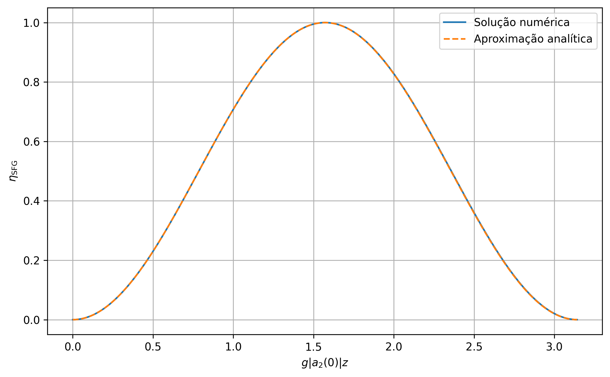
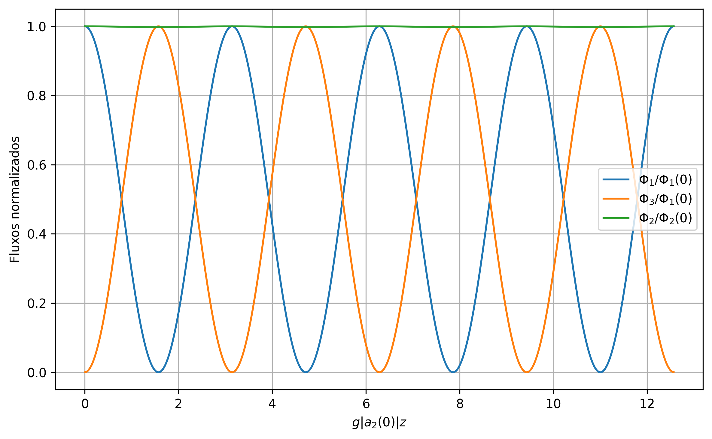
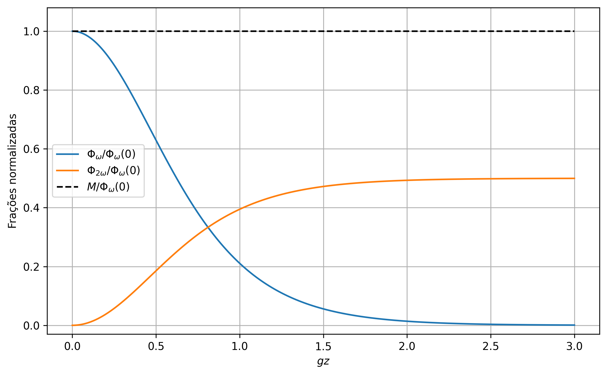
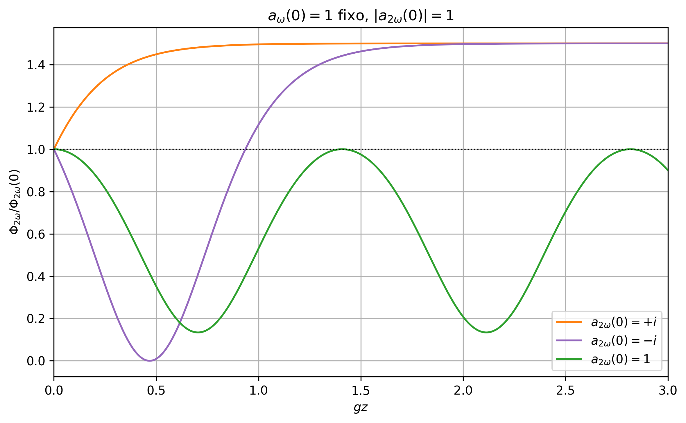
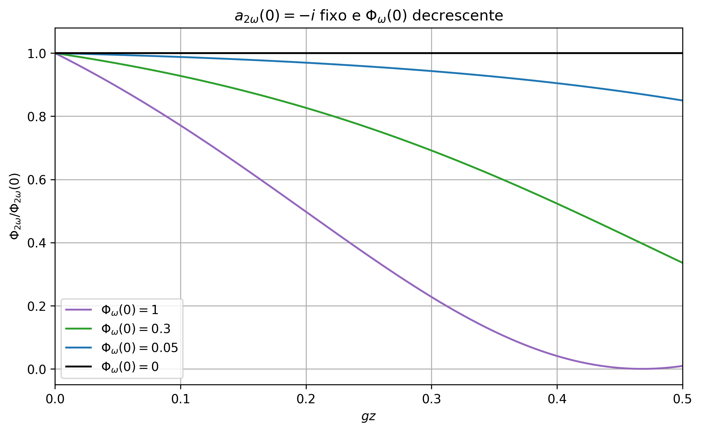
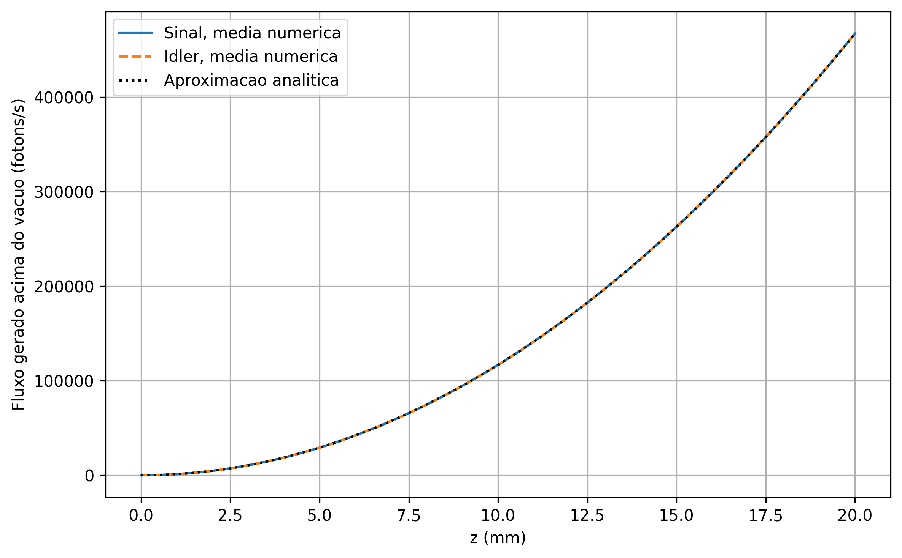

  <b>Student:</b> Caio de Sousa Ribeiro &nbsp;&nbsp;&nbsp;&nbsp; <b>Nº USP:</b> 1368701

***

<h1 align="center">List 1</h1>

### **1.a)**

No modelo de Lorentz, a resposta óptica do material é descrita pelo movimento de um elétron ligado. A equação de movimento pode ser escrita como

$$m\ddot{x}+2m\gamma\dot{x}+\frac{dU}{dx}=-eE(t)$$

onde \(U(x)\) é a energia potencial eletrostática do elétron ligado e \(E(t)\) é o campo elétrico aplicado.

Expandindo o potencial em torno da posição de equilíbrio,

$$U(x)=c_2x^2+c_3x^3+c_4x^4+\cdots$$

temos

$$\frac{dU}{dx}=2c_2x+3c_3x^2+4c_4x^3+\cdots$$

O termo proporcional a \(x\) gera a resposta linear. Os termos não harmônicos, proporcionais a \(x^2,x^3,\ldots\), geram respostas não lineares. Assim, a forma do potencial determina quais ordens de não linearidade podem aparecer na resposta óptica.

A simetria do potencial é essencial. Se o meio possui simetria de inversão, deslocar o elétron para \(+x\) ou para \(-x\) deve custar a mesma energia:

$$U(x)=U(-x)$$

Nesse caso, o potencial é uma função par e sua expansão só contém potências pares de \(x\):

$$U(x)=c_2x^2+c_4x^4+c_6x^6+\cdots$$

Consequentemente, a força restauradora

$$F_{\mathrm{rest}}=-\frac{dU}{dx}$$

é uma função ímpar de \(x\):

$$F_{\mathrm{rest}}(-x)=-F_{\mathrm{rest}}(x)$$

Isso implica que a resposta macroscópica do material também deve respeitar a simetria de inversão. A polarização pode ser expandida em potências do campo:

$$P=\epsilon_0\left(\chi^{(1)}E+\chi^{(2)}E^2+\chi^{(3)}E^3+\cdots\right)$$

Em um meio centrossimétrico, ao inverter o campo elétrico, a polarização também deve inverter:

$$P(-E)=-P(E)$$

Mas, usando a expansão,

$$P(-E)=\epsilon_0\left(-\chi^{(1)}E+\chi^{(2)}E^2-\chi^{(3)}E^3+\cdots\right)$$

Para que \(P(-E)=-P(E)\), todos os termos pares devem desaparecer. Portanto,

$$\chi^{(2)}=0,\qquad \chi^{(4)}=0,\qquad \ldots$$

Portanto, uma resposta de segunda ordem só pode aparecer quando a simetria de inversão é quebrada. No modelo microscópico, isso corresponde a um potencial não centrossimétrico, com termos como \(c_3x^3\). Macroscopicamente, isso permite uma suscetibilidade \(\chi^{(2)}\neq 0\).

Por outro lado, a resposta de terceira ordem é compatível com a simetria de inversão. Mesmo em um meio centrossimétrico, termos pares no potencial, como \(c_4x^4\), podem levar a uma resposta cúbica no campo. Assim,

$$\boxed{\chi^{(2)}\neq 0 \text{ exige ausência de simetria de inversão, enquanto } \chi^{(3)} \text{ pode existir mesmo em meios centrossimétricos}.}$$

### **1.b)**

Considera-se agora um meio com resposta não linear de terceira ordem. Assumindo que estamos longe de ressonâncias e que a absorção pode ser desprezada, $\chi^{(3)}$ pode ser tomado como aproximadamente real. No modelo de Lorentz, uma resposta desse tipo aparece quando se inclui um termo anarmônico de ordem superior no potencial.

Como discutido no item anterior, em um meio centrossimétrico os termos pares da polarização devem desaparecer. Portanto, a menor correção não linear permitida é de terceira ordem:

$$P=\epsilon_0\chi^{(1)}E+\epsilon_0\chi^{(3)}E^3+\cdots$$

Microscopicamente, isso é compatível com um potencial par. O primeiro termo anarmônico permitido pode ser escrito como

$$U(x)\approx \frac{1}{2}m\omega_0^2x^2+\frac{1}{4}mbx^4$$

Nesse caso, a força restauradora é

$$F_{\mathrm{rest}}=-\frac{dU}{dx}=-m\omega_0^2x-mbx^3$$

e a equação de movimento para um elétron ligado sob a ação do campo elétrico $E(t)$ fica

$$\ddot{x}+2\gamma\dot{x}+\omega_0^2x+bx^3=-\frac{e}{m}E(t)$$

O termo $bx^3$ é tratado como uma pequena perturbação. Assim, escreve-se

$$x(t)=x_1(t)+x_3(t)+\cdots$$

onde $x_1$ é a resposta linear e $x_3$ é a correção de terceira ordem.

Para um campo monocromático,

$$E(t)=E(\omega)e^{-i\omega t}+\mathrm{c.c.}$$

a resposta linear satisfaz

$$D(\omega)x_1(\omega)=-\frac{e}{m}E(\omega)$$

com

$$D(\omega)=\omega_0^2-\omega^2-2i\gamma\omega$$

Logo,

$$x_1(\omega)=-\frac{e/m}{D(\omega)}E(\omega)$$

O termo anarmônico atua como uma força efetiva que gera a correção $x_3$. Como $x_1\propto E$, o termo $x_1^3$ gera contribuições proporcionais a $E^3$. Para um campo monocromático, essas contribuições aparecem principalmente em duas frequências: uma em $3\omega$, associada à geração de terceiro harmônico, e outra na própria frequência $\omega$. É essa componente em $\omega$ que altera o índice de refração sentido pelo feixe.

A componente de $x_1(t)^3$ que oscila na frequência fundamental é

$$[x_1^3]_\omega=3|x_1(\omega)|^2x_1(\omega)$$

Substituindo na equação perturbativa para $x_3$, obtemos

$$D(\omega)x_3(\omega)=-3b|x_1(\omega)|^2x_1(\omega)$$

e, usando a expressão de $x_1(\omega)$,

$$x_3(\omega)=
\frac{3b(e/m)^3}{D(\omega)^2|D(\omega)|^2}
|E(\omega)|^2E(\omega)$$

A polarização macroscópica é proporcional ao deslocamento dos elétrons:

$$P=-Nex$$

Assim, a componente de terceira ordem na frequência fundamental é

$$P^{(3)}(\omega)=-Nex_3(\omega)$$

Comparando com a definição macroscópica

$$P^{(3)}(\omega)=3\epsilon_0\chi^{(3)}|E(\omega)|^2E(\omega)$$

extraímos, dentro deste modelo escalar de Lorentz,

$$\chi^{(3)}(\omega)=
-\frac{Nbe^4}{\epsilon_0m^3D(\omega)^2|D(\omega)|^2}$$

O sinal de $\chi^{(3)}$ depende do sinal do coeficiente anarmônico $b$ e das convenções adotadas. Para a estimativa numérica abaixo, é mais seguro usar diretamente um valor experimental de $\chi^{(3)}$ para o material. O importante, aqui, é que o modelo mostra por que a correção gerada por um termo cúbico na força restauradora é proporcional a $|E(\omega)|^2E(\omega)$.

Portanto, a polarização total na frequência $\omega$ pode ser escrita como

$$P(\omega)=\epsilon_0\left[\chi^{(1)}+3\chi^{(3)}|E(\omega)|^2\right]E(\omega)$$

Assim, o campo enxerga uma suscetibilidade efetiva

$$\chi_{\mathrm{eff}}=\chi^{(1)}+3\chi^{(3)}|E(\omega)|^2$$

Como

$$n^2=1+\chi_{\mathrm{eff}}$$

temos

$$n^2(I)=n_0^2+3\chi^{(3)}|E(\omega)|^2 \quad \text{onde} \quad n_0^2=1+\chi^{(1)}$$

Agora relacionamos a amplitude complexa do campo com a intensidade. Como $E_0=2|E(\omega)|$,

$$I=\frac{1}{2}n_0\epsilon_0cE_0^2=2n_0\epsilon_0c|E(\omega)|^2$$

Logo,

$$|E(\omega)|^2=\frac{I}{2n_0\epsilon_0c}$$

Substituindo,

$$n(I)=\sqrt{n_0^2+\frac{3\chi^{(3)}}{2n_0\epsilon_0c}I}$$

Como a correção não linear é pequena, expandimos a raiz:

$$n(I)\approx n_0+\frac{1}{2n_0}\frac{3\chi^{(3)}}{2n_0\epsilon_0c}I$$

Portanto,

$$\boxed{n(I)\approx n_0+n_2I}$$

com

$$\boxed{n_2=\frac{3\chi^{(3)}}{4n_0^2\epsilon_0c}}$$

Até aqui obtivemos a dependência geral pelo modelo de Lorentz. Para particularizar para o nitreto de silício em $\lambda_0=1560\,\mathrm{nm}$, precisamos estimar o índice linear $n_0$ nessa frequência. Como estamos longe de uma ressonância forte do material, a absorção é pequena e podemos usar uma fórmula de Sellmeier para a dispersão linear. Essa é a versão experimental da relação

$$n_0^2(\omega)=1+\chi^{(1)}(\omega)$$

Usando, por exemplo, uma parametrização de Sellmeier para SiN da forma

$$n_0^2(\lambda)=1+\frac{3.585\lambda^2}{\lambda^2-(0.1316)^2}$$

com $\lambda$ em $\mu\mathrm{m}$, temos para $\lambda_0=1.560\,\mu\mathrm{m}$:

$$n_0^2(1.560\,\mu\mathrm{m})\approx 4.61$$

logo

$$n_0(1560\,\mathrm{nm})\approx 2.15$$

Também podemos escrever a dependência espectral de $\chi^{(3)}$ usando a ideia da regra de Miller. Para o efeito Kerr, que envolve a componente em $\omega$, uma forma simples é

$$\chi^{(3)}(\omega;\omega,-\omega,\omega)\approx\delta^{(3)}[\chi^{(1)}(\omega)]^4$$

onde, longe da ressonância,

$$\chi^{(1)}(\omega)=n_0^2(\omega)-1$$

Assim,

$$n_2(\lambda)\approx
\frac{3\delta^{(3)}[n_0^2(\lambda)-1]^4}
{4n_0^2(\lambda)\epsilon_0c}$$

A constante $\delta^{(3)}$ depende do material. Portanto, a fórmula de Sellmeier sozinha fixa a parte linear e a dependência espectral esperada, mas não fixa o valor absoluto de $n_2$. Para obter uma estimativa numérica, usamos um valor experimental de literatura para o nitreto de silício em torno de $1.55\,\mu\mathrm{m}$:

$$\chi^{(3)}(1.55\,\mu\mathrm{m})\approx 3.4\times10^{-21}\,\mathrm{m^2/V^2}$$

Esse valor é citado, por exemplo, por [Zabelich et al., ACS Photonics 2022](https://doi.org/10.1021/acsphotonics.2c00888), ao comparar a suscetibilidade Kerr de nitreto de silício com medidas de efeito Kerr DC.

Substituindo esse valor em

$$n_2=\frac{3\chi^{(3)}}{4n_0^2\epsilon_0c}$$

com $n_0\approx 2.15$, obtemos

$$n_2(1560\,\mathrm{nm})\approx 2.1\times10^{-19}\,\mathrm{m^2/W}$$

Portanto, para o SiN nesse comprimento de onda,

$$\boxed{n(1560\,\mathrm{nm},I)\approx
2.15+\left(2.1\times10^{-19}\,\mathrm{m^2/W}\right)I}$$

com $I$ em $\mathrm{W/m^2}$. Os valores numéricos devem ser lidos como uma estimativa, pois o índice e a não linearidade do SiN variam com a composição e o método de deposição do filme. Como esse valor de $n_2$ é positivo, o índice de refração aumenta com a intensidade do feixe. Fisicamente, esse é o efeito Kerr óptico: o próprio feixe altera o índice que ele enxerga ao se propagar pelo meio. Em um feixe com perfil transversal não uniforme, isso pode levar a uma lente induzida pela própria intensidade, isto é, à autofocalização.

### **2)**

O feixe tem potência \(P_{\mathrm{laser}}=1\,\mathrm{W}\) e é focalizado em um ponto circular de diâmetro \(D = 30\,\mu\mathrm{m}\). Assim, a área iluminada é

$$A=\pi (D/2)^2=\pi(15\times 10^{-6})^2$$

$$A\approx 7.07\times 10^{-10}\,\mathrm{m^2}$$

Logo, a intensidade média do feixe é

$$I=\frac{P_{\mathrm{laser}}}{A}$$

$$I\approx \frac{1}{7.07\times 10^{-10}}\approx 1.4147\times 10^9\,\mathrm{W/m^2}$$

Para relacionar essa intensidade com a amplitude do campo elétrico dentro do cristal, usamos o vetor de Poynting. Para uma onda plana em um meio não magnético de índice de refração \(n\),

$$E(t)=E_0\cos(\omega t)$$

e

$$B(t)=\frac{n}{c}E_0\cos(\omega t)$$

Então,

$$S(t)=\frac{1}{\mu_0}E(t)B(t)=\frac{n}{\mu_0c}E_0^2\cos^2(\omega t) = n\epsilon_0cE_0^2\cos^2(\omega t)$$

A intensidade é o valor médio temporal de \(S(t)\):

$$I=\langle S\rangle=\frac{1}{2}n\epsilon_0cE_0^2 \longrightarrow E_0^2=\frac{2I}{n\epsilon_0c}$$

Substituindo \(n=2\),

$$E_0\approx 7.30\times 10^5\,\mathrm{V/m}$$

A partir daqui, precisamos tomar cuidado com a convenção de amplitude. Nas contas de óptica não linear, costuma-se escrever

$$E(t)=E(\omega)e^{-i\omega t}+\mathrm{c.c.}$$

Como acima usamos \(E(t)=E_0\cos(\omega t)\), temos

$$E(\omega)=\frac{E_0}{2}$$

A polarização de segunda ordem é

$$P^{(2)}(t)=\epsilon_0\chi^{(2)}E^2(t)$$

Na convenção complexa, a amplitude da componente que oscila em \(2\omega\) é

$$P^{(2)}(2\omega)=\epsilon_0\chi^{(2)}[E(\omega)]^2$$

Logo,

$$P^{(2)}(2\omega)=\frac{1}{4}\epsilon_0\chi^{(2)}E_0^2$$

De modo equivalente, usando \(E_0^2=2I/(n\epsilon_0c)\),

$$P^{(2)}(2\omega)=\frac{\chi^{(2)}I}{2nc}$$

Com \(\chi^{(2)}=4\times 10^{-11}\,\mathrm{m/V}\),

$$P^{(2)}(2\omega)=\frac{(4\times 10^{-11})(1.4147\times 10^9)}{2(2)(2.998\times 10^8)}$$

$$\boxed{P^{(2)}(2\omega)\approx 4.72\times 10^{-11}\,\mathrm{C/m^2}}$$

Estima-se agora a amplitude do momento de dipolo por átomo associado à componente em \(2\omega\). A polarização macroscópica é o momento de dipolo por unidade de volume. Assim,

$$P=N\mu$$

onde \(N\) é a densidade de átomos. Como o enunciado não fornece essa densidade, usamos a estimativa típica para um sólido:

$$N\sim 10^{28}\,\mathrm{m^{-3}}$$

Portanto,

$$\mu(2\omega)=\frac{P^{(2)}(2\omega)}{N}$$

Usando o valor encontrado acima,

$$\mu(2\omega)\approx \frac{4.72\times 10^{-11}}{10^{28}}$$

$$\boxed{\mu(2\omega)\approx 4.72\times 10^{-39}\,\mathrm{C\,m}}$$

A unidade atômica de momento de dipolo é

$$ea_0=(1.60\times 10^{-19})(5.29\times 10^{-11})$$

$$ea_0\approx 8.48\times 10^{-30}\,\mathrm{C\,m}$$

Logo,

$$\frac{\mu(2\omega)}{ea_0}\approx \frac{4.72\times 10^{-39}}{8.48\times 10^{-30}}$$

$$\boxed{\frac{\mu(2\omega)}{ea_0}\approx 5.6\times 10^{-10}}$$

Assim, o momento de dipolo não linear por átomo é cerca de \(10^{-9}\) vezes a unidade atômica de dipolo.

Para comparar com a resposta linear do átomo, usamos

$$P^{(1)}(\omega)=\epsilon_0\chi^{(1)}E(\omega)$$

Como

$$n^2=1+\chi^{(1)}$$

temos, para \(n=2\),

$$\chi^{(1)}=n^2-1=3$$

Então,

$$P^{(1)}(\omega)=3\epsilon_0\frac{E_0}{2}$$

Com \(E_0\approx 7.30\times 10^5\,\mathrm{V/m}\),

$$P^{(1)}(\omega)\approx 9.70\times 10^{-6}\,\mathrm{C/m^2}$$

O momento de dipolo linear por átomo é

$$\mu(\omega)=\frac{P^{(1)}(\omega)}{N}$$

$$\boxed{\mu(\omega)\approx 9.70\times 10^{-34}\,\mathrm{C\,m}}$$

Comparando com a unidade atômica,

$$\boxed{\frac{\mu(\omega)}{ea_0}\approx 1.14\times 10^{-4}}$$

Comparando diretamente a resposta não linear com a linear,

$$\frac{\mu(2\omega)}{\mu(\omega)}
\approx
\frac{4.72\times 10^{-39}}{9.70\times 10^{-34}}$$

$$\boxed{\frac{\mu(2\omega)}{\mu(\omega)}\approx 4.9\times 10^{-6}}$$

Portanto, o momento de dipolo induzido em \(2\omega\) é muito pequeno na escala atômica:

$$\mu(2\omega)\sim 10^{-9}ea_0$$

Além disso, ele é muito menor que o momento de dipolo induzido pela resposta linear:

$$\mu(2\omega)\sim 10^{-6}\mu(\omega)$$

Assim, para os campos considerados, a resposta de segunda ordem é uma pequena correção à resposta linear do átomo.

### **3)**

Partimos da equação de onda escalar, tomando a polarização não linear de segunda ordem como fonte. Assumindo uma geometria em que $\vec{E}=\hat{e}E(z,t)$ e a propagação ocorre apenas ao longo de $z$:

$$\frac{\partial^2E}{\partial z^2}-\frac{n^2}{c^2}\frac{\partial^2E}{\partial t^2}=\mu_0\frac{\partial^2P^{(2)}}{\partial t^2}$$

O campo é escrito como a soma de três ondas, com $\omega_3=\omega_1+\omega_2$:

$$E(z,t)=\sum_{j=1}^3 A_j(z)e^{i(k_jz-\omega_jt)}+\mathrm{c.c.}$$

Para incluir absorção, tomamos o vetor de onda como complexo, $k_j=k_j'+ik_j''$. Assim,

$$E_j\propto e^{ik_jz}=e^{ik_j'z}e^{-k_j''z}$$

Logo, como o fluxo é proporcional ao módulo quadrado do campo,

$$\Phi_j\propto |E_j|^2\propto e^{-2k_j''z}$$

Definindo o coeficiente de absorção de intensidade por $\alpha_j=2k_j''$, temos $\Phi_j(z)\propto e^{-\alpha_j z}$. Como $\Phi_j=|a_j|^2$, o efeito isolado da perda sobre a amplitude normalizada é

$$a_j(z)=a_j(0)e^{-\alpha_j z/2}$$

portanto o termo de perda na equação para $a_j$ é

$$\left.\frac{da_j}{dz}\right|_{\mathrm{perda}}=-\frac{\alpha_j}{2}a_j$$

Sem perdas, a polarização não linear de segunda ordem gera os acoplamentos

$$a_3\leftrightarrow a_1a_2,\qquad a_2\leftrightarrow a_1^*a_3,\qquad a_1\leftrightarrow a_2^*a_3$$

Usando $\Delta k=k_3-k_1-k_2$, as equações acopladas com perdas ficam

$$\boxed{\frac{da_3}{dz}=iga_1a_2e^{-i\Delta kz}-\frac{\alpha_3}{2}a_3}$$

$$\boxed{\frac{da_2}{dz}=iga_1^*a_3e^{i\Delta kz}-\frac{\alpha_2}{2}a_2}$$

$$\boxed{\frac{da_1}{dz}=iga_2^*a_3e^{i\Delta kz}-\frac{\alpha_1}{2}a_1}$$

Para ver o efeito das perdas nas relações de Manley-Rowe, definimos

$$X=ga_1a_2a_3^*e^{-i\Delta kz}\quad \text{e}\quad \Phi_j=a_j^*a_j$$

Então,

$$
\begin{align*}
\frac{d\Phi_3}{dz}&=a_3\frac{da_3^*}{dz}+a_3^*\frac{da_3}{dz} \\
&=iX-iX^*-\alpha_3\Phi_3 \\
&=-2\operatorname{Im}(X)-\alpha_3\Phi_3
\end{align*}
$$

Para os outros dois campos,

$$\frac{d\Phi_1}{dz}=2\operatorname{Im}(X)-\alpha_1\Phi_1$$

$$\frac{d\Phi_2}{dz}=2\operatorname{Im}(X)-\alpha_2\Phi_2$$

Assim,

$$\frac{d}{dz}\left(\Phi_1+\Phi_3\right)=-\alpha_1\Phi_1-\alpha_3\Phi_3$$

e

$$\frac{d}{dz}\left(\Phi_2+\Phi_3\right)=-\alpha_2\Phi_2-\alpha_3\Phi_3$$

Portanto, com absorção, as relações de Manley-Rowe não são mais conservadas apenas entre os campos ópticos. Parte da energia é transferida para o meio.

A origem microscópica da absorção não é essencial para essa derivação. O que entra no modelo é o coeficiente efetivo \(\alpha_j\) em cada frequência. A origem da absorção passaria a ser importante se ela dependesse da intensidade, fosse saturável, ou alterasse a própria resposta não linear do material.

### **4.a)**

Os códigos usados nas simulações da questão 4 estão disponíveis em:

[github.com/caiosrr/Disciplinas/tree/main/NLO/Lista_1/q4](https://github.com/caiosrr/Disciplinas/tree/main/NLO/Lista_1/q4)

Primeiro, o problema é resolvido analiticamente usando a aproximação de bomba não depletada. Depois, para comparação, o sistema completo é resolvido numericamente, permitindo que \(a_2\) varie ao longo da propagação.

Na geração de soma de frequências, duas ondas de frequências \(\omega_1\) e \(\omega_2\) interagem em um meio com resposta não linear de segunda ordem, produzindo uma terceira onda na frequência

$$\omega_3=\omega_1+\omega_2$$

Para casamento de fase perfeito, \(\Delta k=0\), as equações acopladas para as amplitudes normalizadas são:

$$\frac{d a_3}{dz}=iga_1a_2$$

$$\frac{d a_2}{dz}=iga_1^*a_3$$

$$\frac{d a_1}{dz}=iga_2^*a_3$$

No regime pedido no enunciado, \(a_1(0)\ll a_2(0)\), pode-se tratar \(a_2\) como uma bomba intensa, aproximadamente constante: \(a_2(z)\approx a_2(0)\)

$$
\begin{align*}\frac{d a_3}{dz}&=iga_1a_2 \\
\frac{d^2a_3}{dz^2}&=iga_2\underbrace{\frac{da_1}{dz}}_{iga_2^*a_3} \\
\frac{d^2a_3}{dz^2}&=-g^2|a_2|^2a_3
\end{align*}
$$

Esse último resultado é a equação de um oscilador harmônico. Como \(a_3(0)=0\), a solução tem a forma

$$a_3(z)=C\sin\left(g|a_2|z\right)$$

Para determinar \(C\), usamos a equação original em \(z=0\):

$$\left.\frac{da_3}{dz}\right|_{z=0}=iga_1(0)a_2$$

Por outro lado,

$$
\begin{align*}
\left.\frac{da_3}{dz}\right|_{z=0}&=C g|a_2|\\
C&=ia_1(0)\frac{a_2}{|a_2|}
\end{align*}
$$

Assim,

$$a_3(z)=ia_1(0)\frac{a_2}{|a_2|}\sin\left(g|a_2|z\right)$$

A eficiência de conversão é definida como a fração do fluxo de fótons \(\Phi_j=|a_j|^2\) inicial da onda fraca convertida para a frequência soma:

$$\eta_{\mathrm{SFG}}(z)=\frac{\Phi_3(z)}{\Phi_1(0)}=\frac{|a_3(z)|^2}{|a_1(0)|^2} = \frac{|a_1(0)|^2\sin^2\left(g|a_2|z\right)}{|a_1(0)|^2}$$

Portanto, na aproximação de bomba não depletada,

$$\eta_{\mathrm{SFG}}^{\mathrm{an}}(z)=\sin^2\left(g|a_2(0)|z\right)$$

Em seguida, o sistema completo é resolvido numericamente por Runge-Kutta de quarta ordem. As condições iniciais escolhidas foram

$$a_1(0)=1,\qquad a_2(0)=20,\qquad a_3(0)=0$$

Essa escolha satisfaz \(a_1(0)\ll a_2(0)\), com \(a_2\) atuando como uma bomba forte.

A figura compara a solução numérica \(\eta_{\mathrm{SFG}}^{\mathrm{num}}\) com a aproximação analítica \(\eta_{\mathrm{SFG}}^{\mathrm{an}}\) para a eficiência.

As duas curvas praticamente coincidem. Isso ocorre porque, apesar de \(a_2\) poder variar no sistema numérico completo, sua depleção é muito pequena nesse regime. Como \(\Phi_1(0)=1\) e \(\Phi_2(0)=400\), mesmo a conversão completa da onda fraca consome apenas uma fração muito pequena da bomba. A depleção máxima de \(\Phi_2\) neste caso foi calculada como \(0.25\%\).

Para verificar a consistência da integração, também avaliamos as quantidades conservadas \(\Phi_1+\Phi_3\) e \(\Phi_2+\Phi_3\).

Os erros máximos encontrados foram da ordem de \(10^{-12}\), indicando que a solução numérica preserva bem as relações de conservação esperadas.

A figura seguinte mostra os fluxos normalizados em um intervalo maior de propagação. Ela evidencia a conversão entre \(a_1\) e \(a_3\), enquanto a bomba \(a_2\) permanece praticamente constante.

Assim, no regime \(a_1(0)\ll a_2(0)\), a solução numérica do sistema completo fica praticamente indistinguível da solução analítica aproximada. Portanto, a eficiência de geração de soma de frequências é bem descrita por

$$\boxed{\eta_{\mathrm{SFG}}=\sin^2\left(g|a_2(0)|z\right)}$$

ou, em termos do fluxo da bomba,

$$\boxed{\eta_{\mathrm{SFG}}=\sin^2\left(g\sqrt{\Phi_2(0)}z\right)}$$

### **4.b)**

Considera-se agora a geração de segundo harmônico, ou seja, o caso degenerado em que duas ondas na frequência \(\omega\) geram uma onda em \(2\omega\). Partindo das equações acopladas obtidas no item 4.a), para \(\Delta k=0\), temos que \(a_1\) e \(a_2\) não são mais dois campos independentes.

Na SHG degenerada, eles correspondem ao mesmo campo fundamental \(a_\omega\). Assim, a variação de \(a_\omega\) recebe as duas contribuições que antes apareciam separadamente em \(a_1\) e \(a_2\):

$$\frac{d a_\omega}{dz}=iga_2^*a_3+iga_1^*a_3$$

fazendo

$$a_1=a_2=a_\omega,\qquad a_3=a_{2\omega}$$

obtemos

$$\frac{d a_\omega}{dz}=2iga_\omega^*a_{2\omega}$$

e

$$\frac{d a_{2\omega}}{dz}=iga_\omega^2$$

Portanto, as equações acopladas para SHG ficam

$$
\begin{align*}
  \frac{d a_\omega}{dz}&=2iga_\omega^*a_{2\omega} \\
  \frac{d a_{2\omega}}{dz}&=iga_\omega^2
\end{align*}
$$

Definindo

$$\Phi_\omega=|a_\omega|^2 = a_{\omega}^*a_\omega,\qquad \Phi_{2\omega}=|a_{2\omega}|^2 = a_{2\omega}^*a_{2\omega}$$

temos

$$
\begin{align*}
\frac{d\Phi_\omega}{dz}&=\frac{d a_\omega}{dz}a_\omega^*+a_\omega\frac{d a_\omega^*}{dz} \\
&=2ig(a_\omega^*)^2a_{2\omega}-2iga_\omega^2a_{2\omega}^* \\
&=4g\operatorname{Im}\left(a_\omega^2a_{2\omega}^*\right)
\end{align*}
$$

e

$$
\begin{align*}
\frac{d\Phi_{2\omega}}{dz}&=\frac{d a_{2\omega}}{dz}a_{2\omega}^*+a_{2\omega}\frac{d a_{2\omega}^*}{dz} \\
&=iga_\omega^2a_{2\omega}^*-ig(a_\omega^*)^2a_{2\omega} \\
&=-2g\operatorname{Im}\left(a_\omega^2a_{2\omega}^*\right)
\end{align*}
$$

Assim,

$$\frac{d\Phi_{\omega}}{dz} + 2\frac{d\Phi_{2\omega}}{dz} = 4g\operatorname{Im}\left(a_\omega^2a_{2\omega}^*\right) + 2\left[-2g\operatorname{Im}\left(a_\omega^2a_{2\omega}^*\right)\right] = 0$$

$$\frac{d}{dz}\left(\Phi_\omega+2\Phi_{2\omega}\right)=0$$

logo a relação de Manley-Rowe para esse caso é

$$\boxed{M=\Phi_\omega+2\Phi_{2\omega}=\mathrm{constante}}$$

Para o cálculo numérico, o sistema foi resolvido por RK4 com

$$a_\omega(0)=1,\qquad a_{2\omega}(0)=0,\qquad 0\le gz\le 3$$

No gráfico, \(\Phi_\omega/\Phi_\omega(0)\) vai praticamente a zero, enquanto \(\Phi_{2\omega}/\Phi_\omega(0)\) se aproxima de \(0.5\). Isso ocorre porque dois fótons de frequência \(\omega\) geram um fóton de frequência \(2\omega\). A quantidade conservada \(M/\Phi_\omega(0)\) permanece constante e igual a \(1\), como esperado pela relação de Manley-Rowe.

Numericamente, no final da simulação,

$$\frac{\Phi_\omega(gz = 3)}{\Phi_\omega(0)}\approx 8.26\times 10^{-4}$$

$$\frac{\Phi_{2\omega}(gz = 3)}{\Phi_\omega(0)}\approx 0.4996$$

$$\frac{2\Phi_{2\omega}(gz = 3)}{\Phi_\omega(0)}\approx 0.9992$$

Portanto, no caso ideal com casamento de fase, a fundamental é quase totalmente convertida em segundo harmônico. O fluxo \(\Phi_{2\omega}\) se aproxima de \(\Phi_\omega(0)/2\), pois dois fótons em \(\omega\) geram um fóton em \(2\omega\). Esse comportamento é justamente o esperado pela relação de Manley-Rowe, já que a quantidade \(\Phi_\omega+2\Phi_{2\omega}\) permanece conservada.

### **4.c)**

Repete-se o problema anterior considerando que os dois campos têm o mesmo fluxo inicial de fótons:

$$\Phi_\omega(0)=\Phi_{2\omega}(0)$$

Como \(\Phi=|a|^2\), isso fixa apenas o módulo das amplitudes. A fase relativa entre \(a_\omega(0)\) e \(a_{2\omega}(0)\) ainda pode mudar.

Mantemos

$$a_\omega(0)=1,\qquad |a_{2\omega}(0)|=1$$

e comparamos três escolhas:

$$a_{2\omega}(0)=+i,\qquad a_{2\omega}(0)=-i,\qquad a_{2\omega}(0)=1$$

Para entender o comportamento inicial, usamos a expressão obtida no item 4.b):

$$\frac{d\Phi_{2\omega}}{dz}=-2g\operatorname{Im}\left(a_\omega^2a_{2\omega}^*\right)$$

Para \(a_\omega(0)=1\), temos:

$$a_{2\omega}(0)=+i\quad\Rightarrow\quad a_\omega^2a_{2\omega}^*=-i\quad\Rightarrow\quad \frac{d\Phi_{2\omega}}{dz}>0$$

então o campo \(2\omega\) é inicialmente amplificado.

Já para

$$a_{2\omega}(0)=-i\quad\Rightarrow\quad a_\omega^2a_{2\omega}^*=i\quad\Rightarrow\quad \frac{d\Phi_{2\omega}}{dz}<0$$

o campo \(2\omega\) é inicialmente deamplificado. Esse caso corresponde ao início de uma dinâmica de conversão por diferença de frequências, em que energia é transferida de \(2\omega\) para \(\omega\).

Por fim, para

$$a_{2\omega}(0)=1\quad\Rightarrow\quad a_\omega^2a_{2\omega}^*=1\quad\Rightarrow\quad \frac{d\Phi_{2\omega}}{dz}=0$$

a variação inicial do fluxo em \(2\omega\) é nula, mas a fase relativa evolui durante a propagação e a dinâmica não permanece estacionária.

O cálculo numérico foi feito por RK4, usando as mesmas equações acopladas da SHG e \(\Delta k=0\).

O resultado depende da fase inicial de \(a_{2\omega}\), mesmo mantendo \(\Phi_\omega(0)=\Phi_{2\omega}(0)\). Para \(a_{2\omega}(0)=+i\), o segundo harmônico cresce diretamente. Para \(a_{2\omega}(0)=-i\), o segundo harmônico primeiro é deamplificado quase até zero, mas depois volta a crescer. Isso acontece porque a transferência inicial para a fundamental aumenta \(\Phi_\omega\), favorecendo posteriormente a geração de segundo harmônico.

Como neste caso

$$M=\Phi_\omega+2\Phi_{2\omega}=3$$

o maior valor possível para \(\Phi_{2\omega}\), quando \(\Phi_\omega\) fica próximo de zero, é

$$\Phi_{2\omega,\max}=\frac{3}{2}$$

Isso explica o platô próximo de \(1.5\) observado nos casos \(a_{2\omega}(0)=+i\) e \(a_{2\omega}(0)=-i\). Numericamente, a relação de Manley-Rowe foi preservada com erro máximo da ordem de \(10^{-12}\), mostrando que as diferenças entre as curvas vêm da fase relativa inicial e não de perda numérica da conservação.

### **4.d)**

Parte-se do caso de deamplificação do item anterior e diminui-se o fluxo inicial na fundamental. Assim, mantemos

$$a_{2\omega}(0)=-i,\qquad \Phi_{2\omega}(0)=1$$

e variamos

$$\Phi_\omega(0)=1,\qquad 0.3,\qquad 0.05,\qquad 0$$

Como \(a_\omega(0)\) foi tomado real, temos \(a_\omega(0)=\sqrt{\Phi_\omega(0)}\). Usando novamente

$$\frac{d\Phi_{2\omega}}{dz}=-2g\operatorname{Im}\left(a_\omega^2a_{2\omega}^*\right)$$

e, para \(a_{2\omega}(0)=-i\),

$$a_\omega^2a_{2\omega}^*=i\Phi_\omega(0)$$

obtemos a variação inicial

$$\left.\frac{d\Phi_{2\omega}}{dz}\right|_{z=0}=-2g\Phi_\omega(0)$$

Portanto, quanto menor for a semente na fundamental, menor será a deamplificação inicial do campo em \(2\omega\).

O cálculo numérico foi feito no intervalo \(0\le gz\le0.5\).

Os valores numéricos obtidos foram:

$$\Phi_\omega(0)=1\quad\Rightarrow\quad \Phi_{2\omega}(gz = 0.5) \approx 0.0092$$

$$\Phi_\omega(0)=0.3\quad\Rightarrow\quad \Phi_{2\omega}(gz = 0.5) \approx 0.3360$$

$$\Phi_\omega(0)=0.05\quad\Rightarrow\quad \Phi_{2\omega}(gz = 0.5) \approx 0.8500$$

$$\Phi_\omega(0)=0\quad\Rightarrow\quad \Phi_{2\omega}(gz = 0.5) = 1$$

No limite \(\Phi_\omega(0)=0\), temos \(a_\omega(0)=0\). Então, pelas equações acopladas,

$$\frac{d a_\omega}{dz}=2iga_\omega^*a_{2\omega}=0,\qquad \frac{d a_{2\omega}}{dz}=iga_\omega^2=0$$

Assim, no modelo clássico, o campo em \(2\omega\) não gera sozinho um campo em \(\omega\). A conversão por diferença de frequências precisa de uma semente clássica na fundamental. A relação de Manley-Rowe continuou preservada numericamente, com erros da ordem de \(10^{-15}\).

### **4.e)**

Agora usamos a mesma ideia de conversão por diferença de frequências para construir um modelo semiclássico simples de SPDC. No item 4.d), vimos que, se o campo gerado começa exatamente com amplitude nula, o modelo clássico não produz nada. A ideia semiclássica é substituir essa amplitude inicial nula por uma pequena semente associada à energia de vácuo dos modos gerados.

A onda de maior frequência, \(a_3\), é tratada como a bomba, enquanto \(a_1\) e \(a_2\) são os campos gerados, sinal e idler, satisfazendo

$$\omega_3=\omega_1+\omega_2$$

Para casamento de fase perfeito, ou quase-casamento de fase ideal, as equações normalizadas são as mesmas da geração de soma de frequências, mas interpretadas no sentido de conversão descendente:

$$\frac{da_1}{dz}=iga_2^*a_3$$

$$\frac{da_2}{dz}=iga_1^*a_3$$

$$\frac{da_3}{dz}=iga_1a_2$$

com

$$\Phi_j=|a_j|^2$$

sendo o fluxo de fótons da onda \(j\).

Para usar os parâmetros reais do cristal, precisamos relacionar as amplitudes normalizadas \(a_j\) com os campos elétricos. Como \(\Phi_j=|a_j|^2\) é fluxo de fótons, a potência pode ser escrita tanto como \(P_j=\hbar\omega_j|a_j|^2\) quanto como \(P_j=2n_j\epsilon_0cA|E_j|^2\). Logo,

$$E_j=\sqrt{\frac{\hbar\omega_j}{2n_j\epsilon_0cA}}\,a_j$$

Substituindo essa normalização nas equações acopladas, a constante \(g\) fica

$$\boxed{
g=d_{\mathrm{eff}}
\sqrt{\frac{\hbar\omega_1\omega_2\omega_3}
{2\epsilon_0c^3A\,n_1n_2n_3}}}
$$

No caso de quase-casamento de fase de primeira ordem em LiNbO\(_3\), usando a inversão periódica do sinal de \(d_{33}\), o coeficiente efetivo é reduzido pelo primeiro harmônico da rede:

$$d_{\mathrm{eff}}\approx\frac{2}{\pi}d_{33}$$

Como o enunciado menciona canais TELECOM de \(100\,\mathrm{GHz}\), considerei o caso degenerado em telecom. Assim, os dois fótons gerados têm o mesmo comprimento de onda em torno de \(1550\,\mathrm{nm}\), e a bomba fica em \(775\,\mathrm{nm}\):

$$\lambda_1=\lambda_2=1550\,\mathrm{nm},\qquad \lambda_3=775\,\mathrm{nm}$$

O código usado neste item foi salvo em `q4/q4e.py`. Usei os parâmetros do enunciado:

$$L=20\,\mathrm{mm},\qquad P_3(0)=1\,\mathrm{mW},\qquad r_{\mathrm{feixe}}=50\,\mu\mathrm{m}$$

de modo que

$$A=\pi r_{\mathrm{feixe}}^2\simeq7.85\times10^{-9}\,\mathrm{m^2}$$

Como a interação é tipo-0, os três campos têm a mesma polarização. Em LiNbO\(_3\) periodicamente polarizado, isso permite usar o maior coeficiente não linear, \(d_{33}\), associado ao eixo extraordinário. Assim, tomei

$$n_1=n_2\simeq2.138,\qquad n_3\simeq2.179$$

e \(d_{33}\simeq27\,\mathrm{pm/V}\), valores obtidos de tabelas de LiNbO\(_3\). Com o fator de quase-casamento de fase,

$$d_{\mathrm{eff}}\simeq\frac{2}{\pi}(27\,\mathrm{pm/V})\simeq17.2\,\mathrm{pm/V}$$

Com esses valores,

$$g\simeq1.73\times10^{-9}\,\mathrm{m^{-1}}(\mathrm{s^{-1}})^{-1/2}$$

O fluxo de fótons da bomba é

$$\Phi_3(0)=\frac{P_3}{\hbar\omega_3}\simeq3.90\times10^{15}\,\mathrm{s^{-1}}$$

Agora entra a parte semiclássica. Para cada campo gerado, colocamos inicialmente a energia de vácuo

$$U_{\mathrm{vac}}=\frac{1}{2}\hbar\omega_j$$

Para converter essa energia em fluxo, precisamos escolher uma janela temporal. O enunciado sugere uma largura de banda de \(100\,\mathrm{GHz}\), compatível com canais ITU, então

$$\tau\simeq\frac{1}{\Delta\nu}=\frac{1}{100\times10^9}\simeq10\,\mathrm{ps}$$

Isso equivale a tomar, para cada campo gerado, um pacote temporal de comprimento \(v_j\tau\simeq(c/n_j)\tau\), isto é, um volume efetivo

$$V_j\simeq A\frac{c}{n_j}\tau$$

Com isso, o fluxo de fótons equivalente ao vácuo em cada modo é

$$\Phi_{\mathrm{vac}}=
\frac{(1/2)\hbar\omega_j}{\hbar\omega_j\tau}
=\frac{1}{2\tau}
=\frac{\Delta\nu}{2}
\simeq5.0\times10^{10}\,\mathrm{s^{-1}}$$

As condições iniciais usadas no código foram, portanto,

$$a_1(0)=\sqrt{\Phi_{\mathrm{vac}}}e^{i\varphi},\qquad
a_2(0)=\sqrt{\Phi_{\mathrm{vac}}},\qquad
a_3(0)=\sqrt{\Phi_3(0)}$$

Como a fase do campo de vácuo não é definida, o cálculo numérico foi repetido para várias fases relativas \(\varphi\), e depois foi tomada a média. Isso evita escolher artificialmente uma fase de amplificação ou deamplificação.

O parâmetro de ganho esperado é

$$r=g\sqrt{\Phi_3(0)}L\simeq2.16\times10^{-3}$$

Como \(r\ll1\), o processo está no regime de baixo ganho e a bomba praticamente não deve depletar. Nesse limite, uma estimativa útil para checar a ordem de grandeza é

$$\Phi_{\mathrm{SPDC}}\sim\Delta\nu\sinh^2r\approx\Delta\nu r^2$$

Numericamente, obtive

$$\Phi_1(L)\simeq5.000047\times10^{10}\,\mathrm{s^{-1}}$$

$$\Phi_2(L)\simeq5.000047\times10^{10}\,\mathrm{s^{-1}}$$

Esses valores incluem o fluxo equivalente de vácuo. Subtraindo o fundo de vácuo, o fluxo gerado por SPDC é

$$\boxed{\Phi_{\mathrm{SPDC}}\simeq4.7\times10^5\,\mathrm{pares/s}}$$

A figura mostra o crescimento do fluxo gerado ao longo do cristal. A linha pontilhada corresponde à estimativa de baixo ganho acima, usada apenas como checagem da simulação.

A depleção relativa da bomba foi

$$\frac{\Phi_3(0)-\Phi_3(L)}{\Phi_3(0)}
\simeq1.2\times10^{-10}$$

e as relações de Manley-Rowe foram preservadas numericamente com erro máximo da ordem de \(10^{-15}\).

Portanto, diferentemente do modelo clássico com semente exatamente nula, o modelo semiclássico prevê geração de pares porque os modos sinal e idler começam com uma semente associada à energia de vácuo. O resultado depende da largura de banda escolhida, pois ela define o número de modos temporais considerados. Para uma largura de banda de \(100\,\mathrm{GHz}\), uma bomba de \(1\,\mathrm{mW}\) e um cristal de LiNbO\(_3\) de \(20\,\mathrm{mm}\), a taxa estimada é da ordem de \(10^5\) pares por segundo.

### **5.a)**
Foram consultadas as seguintes referências para os valores numéricos do KTP usados nesta questão:

- [PMOptics, Potassium Titanyl Phosphate](https://www.pmoptics.com/potassium_titanyl_phosphate.html)
- [Frequency Conversion in KTP Crystal and Its Isomorphs](https://www.mdpi.com/2073-4352/8/10/386)

Temos dois campos de entrada com o mesmo comprimento de onda,

$$\lambda_1=\lambda_2=1064\,\mathrm{nm}$$

mas com polarizações ortogonais. Como a propagação ocorre no plano \(XY\), fazendo um ângulo \(\phi\) com o eixo \(x\), podemos escrever

$$\hat{k}=\cos\phi\,\hat{x}+\sin\phi\,\hat{y}$$

Para essa geometria, os dois modos próprios de polarização são:

- um modo polarizado ao longo de \(\hat{z}\);
- um modo polarizado no plano \(XY\), perpendicular à propagação.

Assim, para os dois campos fundamentais ortogonais, tomamos

$$E_1(\omega)\parallel \hat{z}$$

e

$$E_2(\omega)\parallel XY$$

Como as frequências de entrada são iguais, a frequência soma é

$$\omega_3=\omega_1+\omega_2=2\omega$$

ou seja,

$$\lambda_3=532\,\mathrm{nm}$$

A condição de casamento de fase é

$$k_3=k_1+k_2$$

Usando \(k=n\omega/c\), temos

$$\frac{n_3(2\omega)(2\omega)}{c}=\frac{n_1(\omega)\omega}{c}+\frac{n_2(\omega)\omega}{c}$$

Logo,

$$n_3(2\omega)=\frac{n_1(\omega)+n_2(\omega)}{2}$$

Agora comparamos as possibilidades. Em KTP, para \(1064\,\mathrm{nm}\), os índices principais são aproximadamente

$$n_x\simeq 1.738,\qquad n_y\simeq 1.745,\qquad n_z\simeq 1.830$$

Como um dos campos fundamentais está polarizado em \(z\), seu índice é fixo e igual a \(n_z(1064)\). O outro campo fundamental está polarizado no plano \(XY\), então ele sente um índice efetivo \(n_{XY}(1064,\phi)\), que varia com o ângulo de propagação. Como esse modo no plano \(XY\) mistura os eixos \(x\) e \(y\), seu índice efetivo fica entre os dois índices principais:

$$n_x(1064)\lesssim n_{XY}(1064,\phi)\lesssim n_y(1064)$$

Portanto, o índice que o campo gerado precisaria ter para satisfazer o casamento de fase fica no intervalo

$$\frac{n_z(1064)+n_x(1064)}{2}\lesssim n_3(532,\phi)\lesssim \frac{n_z(1064)+n_y(1064)}{2}$$

isto é,

$$1.784\lesssim n_3(532,\phi)\lesssim 1.788$$

Portanto, para haver casamento de fase, o campo gerado em \(532\,\mathrm{nm}\) deve ter índice nessa faixa.

Em \(532\,\mathrm{nm}\), o índice para polarização em \(z\) é aproximadamente

$$n_z(532)\simeq 1.889$$

que é muito maior que o intervalo necessário. Logo, o campo soma não pode ser polarizado em \(z\) para satisfazer o casamento de fase.

Por outro lado, o índice efetivo do modo polarizado no plano \(XY\) em \(532\,\mathrm{nm}\) varia com \(\phi\) entre

$$n_x(532)\simeq 1.778$$

e

$$n_y(532)\simeq 1.789$$

Esse intervalo contém os valores necessários para o casamento de fase. Portanto, o campo de soma deve ser polarizado no plano \(XY\).

Assim, a interação tem a forma

$$\boxed{z+XY\rightarrow XY}$$

Ou seja, um dos campos fundamentais é polarizado ao longo de \(z\), o outro é polarizado no plano \(XY\), e o campo de soma de frequências também é polarizado no plano \(XY\).

### **5.b)**

Agora calculamos o ângulo \(\phi\) que satisfaz o casamento de fase para a interação encontrada no item anterior:

$$z+XY\rightarrow XY$$

O campo polarizado em \(z\) tem índice

$$n_z(1064)$$

enquanto os campos polarizados no plano \(XY\) têm índice efetivo dependente do ângulo. Para propagação no plano \(XY\),

$$\hat{k}=\cos\phi\,\hat{x}+\sin\phi\,\hat{y}$$

o índice efetivo do modo polarizado no plano \(XY\) é

$$\boxed{\frac{1}{n_{XY}^2(\lambda,\phi)}=\frac{\cos^2\phi}{n_y^2(\lambda)}+\frac{\sin^2\phi}{n_x^2(\lambda)}}$$

Essa expressão tem os limites esperados: para \(\phi=0\), a propagação é ao longo de \(x\) e a polarização no plano \(XY\) fica ao longo de \(y\), de modo que \(n_{XY}=n_y\). Para \(\phi=90^\circ\), a propagação é ao longo de \(y\) e a polarização fica ao longo de \(x\), de modo que \(n_{XY}=n_x\).

A condição de casamento de fase é

$$k_{2\omega}=k_{\omega,z}+k_{\omega,XY}$$

Como \(k=n\omega/c\),

$$\frac{2\omega}{c}n_{XY}(532,\phi)=\frac{\omega}{c}n_z(1064)+\frac{\omega}{c}n_{XY}(1064,\phi)$$

Logo,

$$\boxed{n_{XY}(532,\phi)=\frac{n_z(1064)+n_{XY}(1064,\phi)}{2}}$$

Usando os índices aproximados do KTP em temperatura ambiente,

$$n_x(1064)\simeq 1.738,\qquad n_y(1064)\simeq 1.745,\qquad n_z(1064)\simeq 1.830$$

e

$$n_x(532)\simeq 1.778,\qquad n_y(532)\simeq 1.789$$

a equação de casamento de fase foi resolvida numericamente. O resultado é

$$\phi\simeq 23.6^\circ$$

Nesse ângulo,

$$n_{XY}(1064,\phi)\simeq 1.744$$

e

$$n_{XY}(532,\phi)\simeq 1.787$$

De fato,

$$\frac{n_z(1064)+n_{XY}(1064,\phi)}{2}\simeq \frac{1.830+1.744}{2}\simeq 1.787$$

que coincide com \(n_{XY}(532,\phi)\). Portanto,

$$\boxed{\phi_{\mathrm{PM}}\simeq 23.6^\circ}$$

### **5.c)**

Agora queremos o coeficiente não linear efetivo da interação

$$z+XY\rightarrow XY$$

Antes de calcular a projeção, precisamos da forma do tensor não linear do KTP. Essa forma não é deduzida dos índices de refração, mas sim da simetria cristalina do material. Nas referências usadas no item 5.a), a PMOptics lista o KTP como um cristal ortorrômbico, e o artigo sobre conversão de frequências em KTP e seus isomorfos afirma que esses cristais pertencem ao grupo pontual \(mm2\).

Dizer que o cristal é ortorrômbico significa que seus três eixos cristalográficos são mutuamente perpendiculares, mas têm comprimentos diferentes, isto é, \(a\neq b\neq c\) e \(\alpha=\beta=\gamma=90^\circ\). Já o grupo pontual \(mm2\) especifica as operações de simetria que deixam o cristal invariante. São essas simetrias que determinam quais elementos do tensor \(\chi^{(2)}\), ou equivalentemente do tensor \(d\), podem ser diferentes de zero.

Usando a notação contraída, em que as colunas correspondem a \(xx,yy,zz,yz,xz,xy\), a forma reduzida permitida para o tensor \(d\) do KTP é

$$
d=
\begin{pmatrix}
0&0&0&0&d_{15}&0\\
0&0&0&d_{24}&0&0\\
d_{31}&d_{32}&d_{33}&0&0&0
\end{pmatrix}
$$

Na nossa geometria, um campo fundamental está em \(z\), enquanto o outro está no plano \(XY\). Como a propagação faz ângulo \(\phi\) com \(x\), a polarização no plano \(XY\), perpendicular a \(\vec{k}\), pode ser escrita como

$$\hat{e}_{XY}=-\sin\phi\,\hat{x}+\cos\phi\,\hat{y}$$

Assim,

$$E_x=-E_{XY}\sin\phi,\qquad E_y=E_{XY}\cos\phi$$

Como o processo mistura um campo em \(z\) com um campo no plano \(XY\), os termos que aparecem são

$$P_x^{(2)}\propto d_{15}E_zE_x,\qquad P_y^{(2)}\propto d_{24}E_zE_y$$

Mas o campo gerado também deve sair no modo \(XY\). Então tomamos a projeção de \(\vec{P}^{(2)}\) nessa direção:

$$P_{XY}^{(2)}=\vec{P}^{(2)}\cdot\hat{e}_{XY}$$

Isso dá

$$d_{\mathrm{eff}}(\phi)=d_{15}\sin^2\phi+d_{24}\cos^2\phi$$

Portanto,

$$\boxed{d_{\mathrm{eff}}(\phi)=d_{15}\sin^2\phi+d_{24}\cos^2\phi}$$

O sinal global pode mudar dependendo da escolha do sentido de \(\hat{e}_{XY}\), mas a eficiência depende de \(|d_{\mathrm{eff}}|^2\), então esse sinal não altera o resultado físico.

No ângulo encontrado no item anterior, \(\phi\simeq23.6^\circ\),

$$d_{\mathrm{eff}}(23.6^\circ)\simeq0.16\,d_{15}+0.84\,d_{24}$$

Usando \(d_{15}\simeq2.0\,\mathrm{pm/V}\) e \(d_{24}\simeq3.7\,\mathrm{pm/V}\), fica

$$d_{\mathrm{eff}}\simeq3.4\,\mathrm{pm/V}$$

### **5.d)**

Resta verificar se algo parecido poderia ser feito no plano \(XZ\). Nesse plano, as duas polarizações seriam:

- uma polarização em \(y\);
- uma polarização no plano \(XZ\).

Para a polarização no plano \(XZ\), o índice efetivo pode variar entre \(n_x\) e \(n_z\). Usando os mesmos índices do item anterior, as condições possíveis ficam muito próximas, mas não fecham exatamente para \(1064\,\mathrm{nm}\).

Por exemplo, se o campo gerado fosse polarizado em \(y\), a condição seria

$$n_y(532)=\frac{n_y(1064)+n_{XZ}(1064,\theta)}{2}$$

O maior valor possível do lado direito seria

$$\frac{n_y(1064)+n_z(1064)}{2}\simeq1.788$$

Mas

$$n_y(532)\simeq1.789$$

Ou seja, falta um pouco para igualar. O outro caso, em que o campo gerado fica no modo \(XZ\), também não cruza a condição de casamento de fase com esses índices.

Assim, para esta interação em \(1064\,\mathrm{nm}\),

$$\boxed{\text{o plano }XZ\text{ não é a escolha adequada para obter casamento de fase perfeito}}$$

Mesmo que em outro comprimento de onda fosse possível casar fase no plano \(XZ\), esse caminho teria uma desvantagem importante: o **walk-off**. No plano \(XY\), o feixe mistura os eixos \(x\) e \(y\), cujos índices são bem próximos. Já no plano \(XZ\), ele mistura \(x\) e \(z\), cujos índices são mais diferentes. Por isso, no plano \(XZ\) a energia do feixe tende a se desviar mais da direção de propagação, fazendo os feixes se separarem lateralmente dentro do cristal. Essa separação reduz a sobreposição entre eles e diminui a eficiência da conversão.
